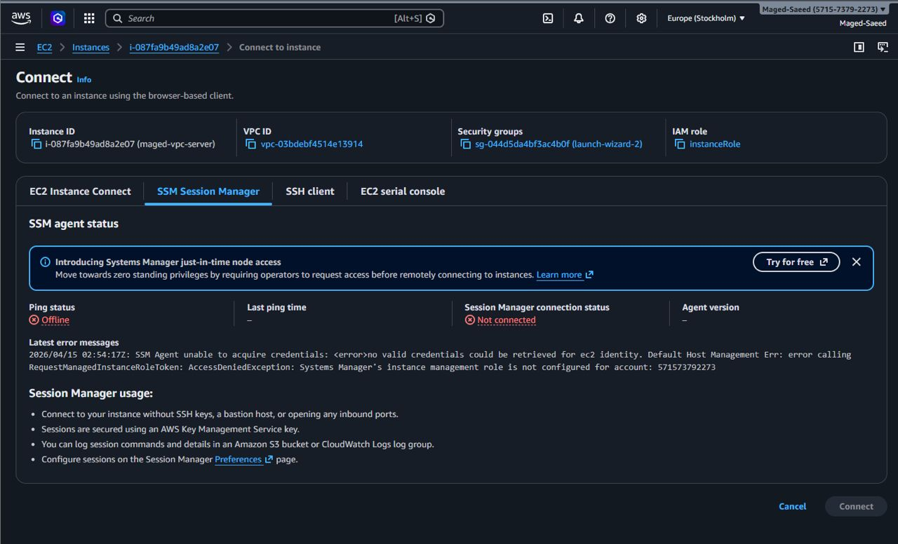
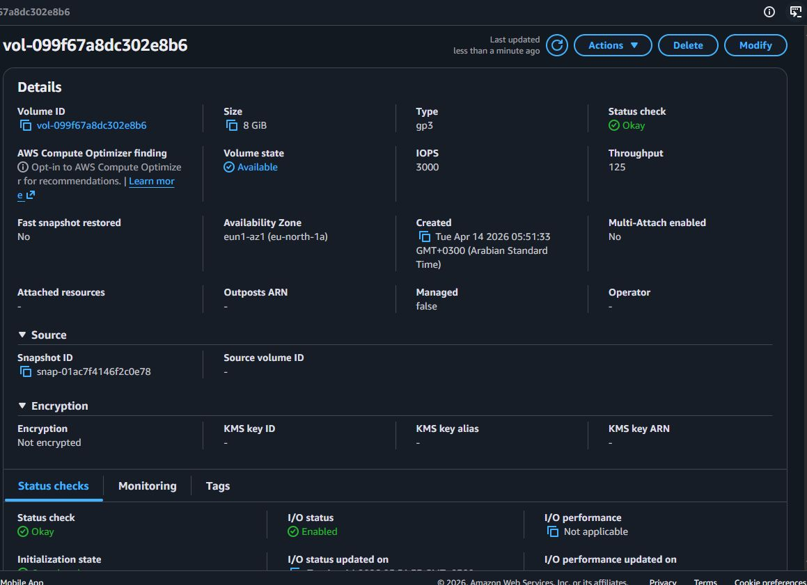
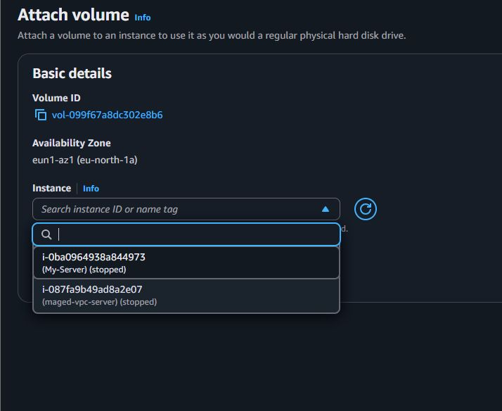
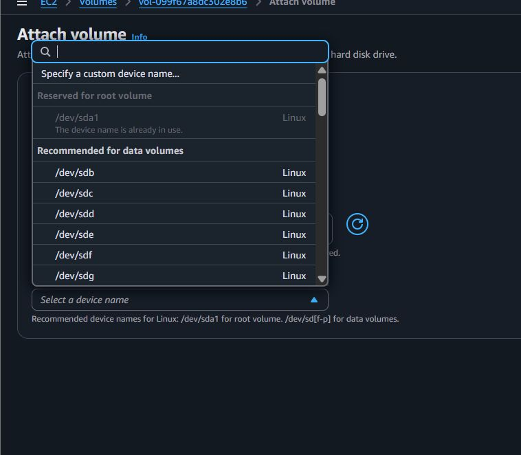
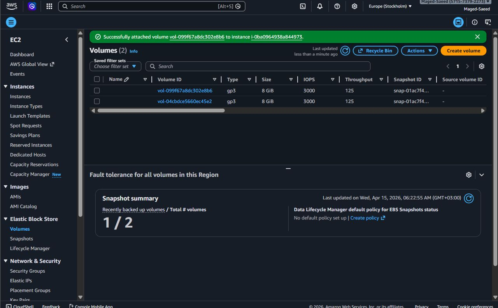
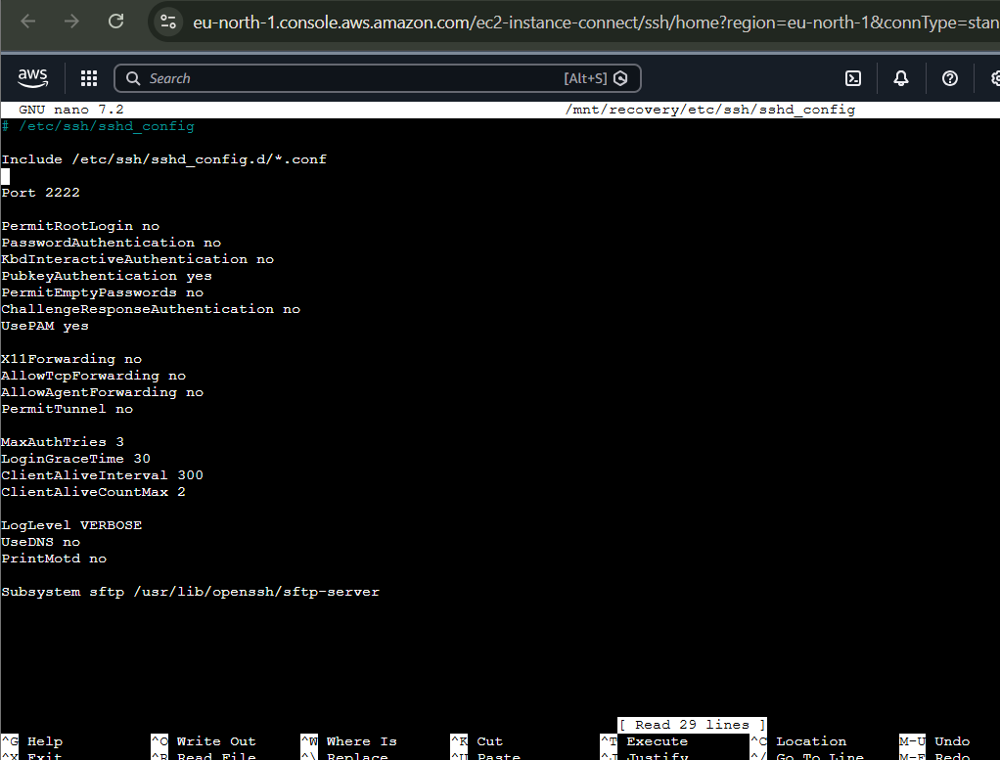
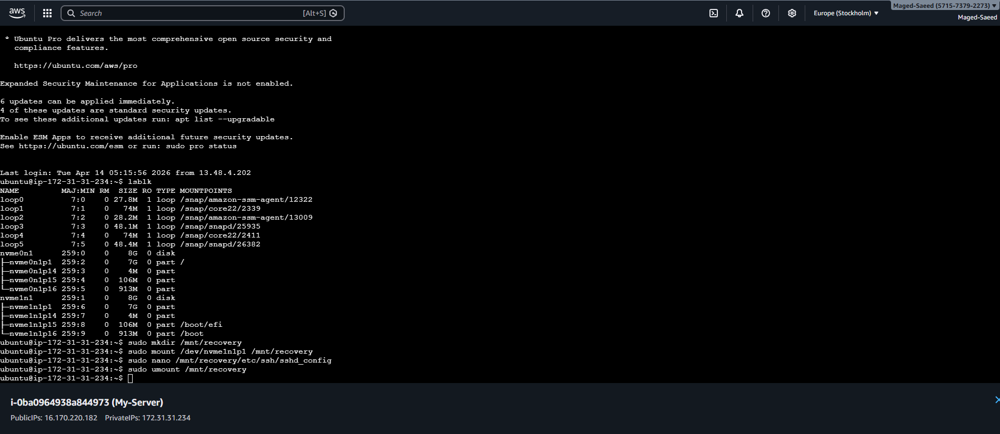

# AWS EC2 SSH Disaster Recovery using EBS Volume Rescue

## 📌 Overview
Real-world incident where SSH access was lost due to misconfiguration. Recovery was done using EBS volume rescue method without data loss.

---

## 🚨 Incident
- SSH port changed to 2222
- Security Group not updated
- SSM not working
- Result: full lockout

---

## 🔍 Root Cause Evidence

### 1. SSM Connection Failure


---

## 🛠 Recovery Process

### 2. Detach Root Volume from Broken Instance


---

### 3. Attach Volume to Recovery Instance (Select Instance)


---

### 4. Choose Device Name


---

### 5. Volume Attached Successfully


---

### 6. Fix SSH Configuration (Mounted Volume)


---

### 7. Execute Recovery Commands


---

## ⚙️ Commands Used

```bash
lsblk
sudo mkdir /mnt/recovery
sudo mount /dev/nvme1n1p1 /mnt/recovery
sudo nano /mnt/recovery/etc/ssh/sshd_config
sudo umount /mnt/recovery
